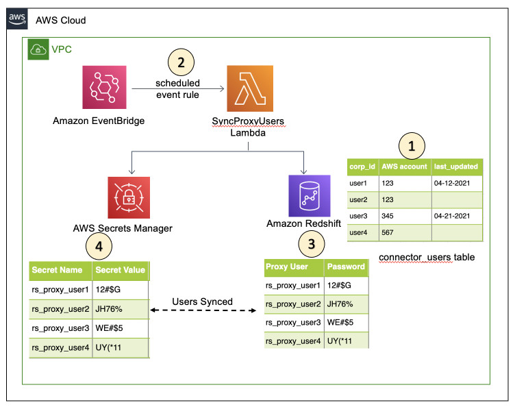

## Table Level Access Control in AFQ

This serverless application handles creation and sync of proxy users in Amazon Redshift and AWS Secrets Manager allowing for table level access control when using the Athena Federated Query SDK.

### Background
Currently, when using the Athena Federated Query SDK, to get table level access control to the underlying database like Amazon Redshift, customers either have to
manually create Secrets with actual credentials in AWS Secrets Manager for all the users or deploy multiple connectors (AWS Lambdas) for each user. This can lead to overheads like maintaining security, managing the lambda function invocations, credential rotations etc.
Also, many customers may not want to store corporate credentials in AWS Secrets Manager for security/policy purposes.

This serverless sync program resolves this issue by creating proxy users mirroring the privlieges of the actual users in Amazon Redshift and syncing them in AWS Secrets Manager. The AFQ SDK connector code then can use these proxy users to connect to Amazon Redshift and provide table level access to the tables and schemas.


### Design



The Sync Program for Amazon Redshift uses following design.
#### Create Proxy Users
1. Customers create a table in Amazon Redshift containing the users who need access to Federated Queries
2. Amazon EventBridge executes a scheduled event rule which triggers the `aws-sync-proxy-redshift-users-app` Lambda function
3. The application queries the user created table in Amazon Redshift and gets the list of users for whom a proxy user needs to be created, synced, deleted.
4. The function then creates a proxy user for each new user in table mirroring the privileges (Group, Schema and Table level access) of the actual user
5. Next, the lambda function creates a Secret for each proxy user which will be used by the AFQ Lambda function
6. Finally, the lambda updates the Amazon Redshift table’s `last_updated` column.
7. Once the Proxy users are set up, we need to add the logic in the deployed JDBC connector code to connect to Redshift using the proxy credentials.

#### Credential Rotation
The `aws-sync-proxy-redshift-users-app` automatically rotates proxy credentials after every 30 days. The app uses the `last_updated` column of the `ConnectorUsersTable` for this purpose.

#### Delete Proxy Users
To delete a user's proxy credentials, the `is_active` column of the `ConnectorUsersTable` of the respective user must be updated to `False`. 
The app will pick this up in the next run and will delete the proxy credentials from AWS Secrets Manager and the `ConnectorUsersTable`. Note that the proxy user will not be deleted from Amazon Redshift, they have to be manually deleted.

#### Logging
All logs can be accessed in the `aws-sync-proxy-redshift-users-app` CLoudWatch Group.

### New Federation Query Flow:
```
1. Federated Query Issued.
2. Athena Federation Query SDK lambda invoked.
3. Parse out the callee ID.
4. Go to Secrets Manager to get the proxy credentials.
5. Connect to Amazon Redshift with proxy credentials.
6. Query Amazon Redshift tables as a proxy user which has exact same privleges of the currently logged in user allowing table level access.
```

### Prerequisites

1. The [Amazon Athena Lambda JDBC Connector](https://github.com/awslabs/aws-athena-query-federation/tree/master/athena-jdbc) deployed in your AWS account
2. The `ConnectorUsersTable` must already be created in Amazon Redshift with below schema:
   ```
   CREATE TABLE <ConnectorUsersSchema>.<ConnectorUsersTable> (
    corp_id varchar,
    aws_account varchar,
    is_active boolean,
    last_updated timestamp without time zone
   );
   ```

### Parameters

The Sync Program for Amazon Redshift exposes several configuration options via Lambda environment variables. More detail on the available parameters can be found below.

* **ExecutionSchedule:** Cron expression to Lambda function through EventBridge rule
* **S3Bucket:** The S3 bucket where the application code will be copied to.
* **SyncProgramName:** AWS Lambda function name.
* **VPC ID:** The VPC Id to be attached to the Lambda function
* **AWS Region:** The AWS Region of the Lambda function
* **ConnectorUsersSchema:** The schema name of the Amazon Redshift table.
* **ConnectorUsersTable:** The table name of the Amazon Redshift table.
* **ProxyUsersPrefix:** Prefix for the proxy users.
* **RedshiftClusterId:** The Redshift Cluster ID.
* **RedshiftDBName:** The Redshift Database Name.
* **RedshiftDBUrl:** The Redshift Database URL.
* **RedshiftDBUser:** The Redshift User.
* **RedshiftPort:** The Redshift Port Number.
* **SubnetIds:** One or more Subnet IDs corresponding to the Subnet that the Lambda function can use to access your data source. (e.g. subnet1, subnet2)


### Deploying The Sync Program

To use the Sync Program build and deploy this application from source follow the below steps:

From the redshift-sync dir, run  `sh ../tools/publish.sh S3_BUCKET_NAME redshift-sync` to publish the connector to your private AWS Serverless Application Repository. The S3_BUCKET in the command is where a copy of the connector's code will be stored for Serverless Application Repository to retrieve it. This will allow users with permission to do so, the ability to deploy instances of the connector via 1-Click form. Then navigate to [Serverless Application Repository](https://aws.amazon.com/serverless/serverlessrepo)

### Post-requisites
1. Once this application is deployed, make sure the app's Security Group has access to the Amazon Redshift's VPC so that the application can connect to Amazon Redshift
2. Add the necessary code to the Amazon Athena JDBC Connector code to parse out the callee ID and build the JDBC connection with proxy credentials.

### Advantages
1. Multiple users can use the same connector for table level access.
2. Automated event-driven creation and sync of proxy users; Just add them to the Amazon Redshift table.
3. Automated credential rotation every 30 days.
4. Actual Amazon Redshift credentials are not stored in AWS Secrets Manager, saving security overheads.
5. Easy to maintain the users who need access to federated queries.

### Limitations
1. All usual AWS Lambda limits.

### References
1. [Amazon Athena Federated Query](https://docs.aws.amazon.com/athena/latest/ug/connect-to-a-data-source.html)
2. [Athena Federation SDK](https://github.com/awslabs/aws-athena-query-federation/tree/master/athena-federation-sdk)

## Security

See [CONTRIBUTING](CONTRIBUTING.md#security-issue-notifications) for more information.

## License

This project is licensed under the Apache-2.0 License.

